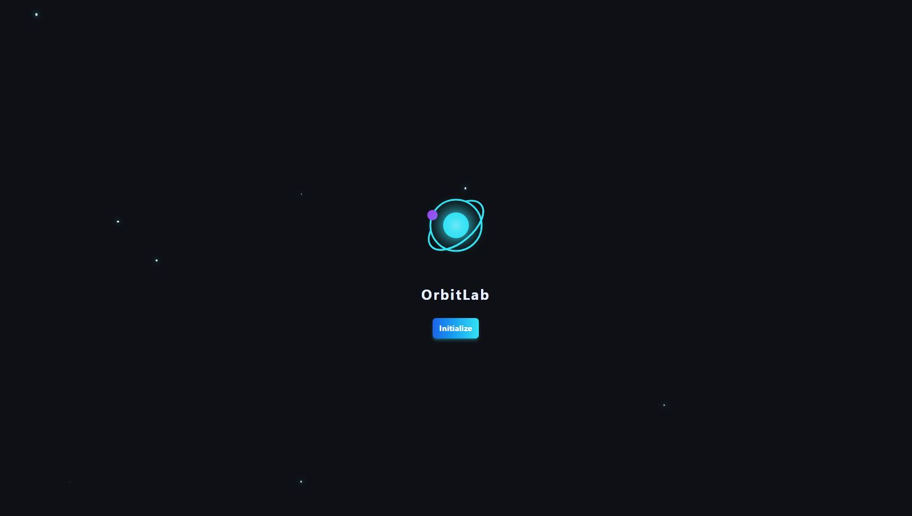
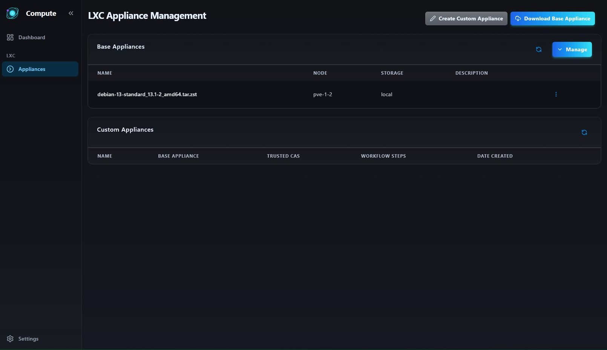
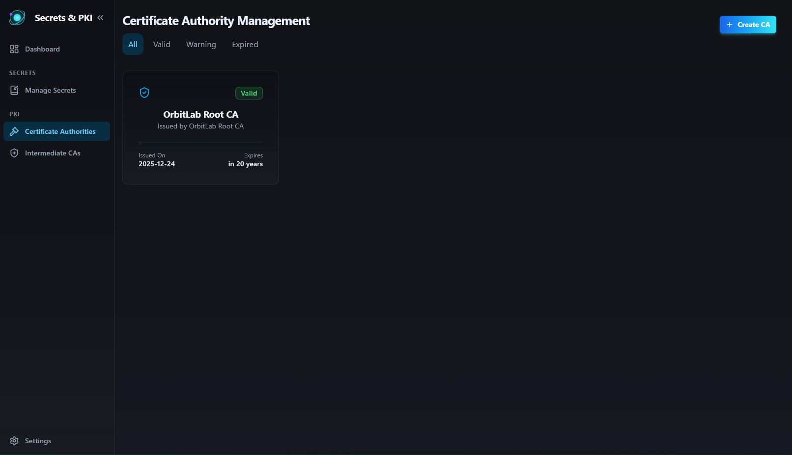
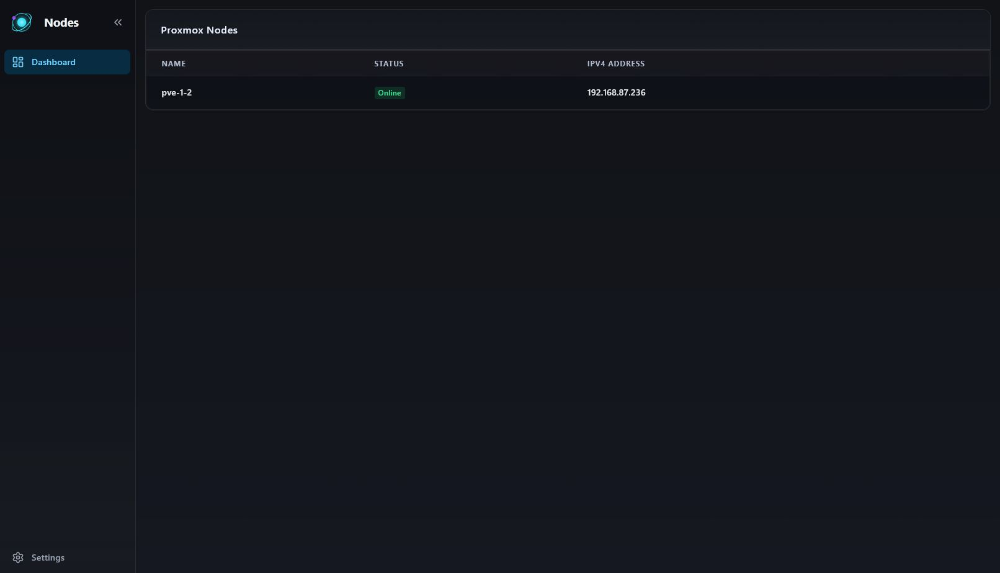
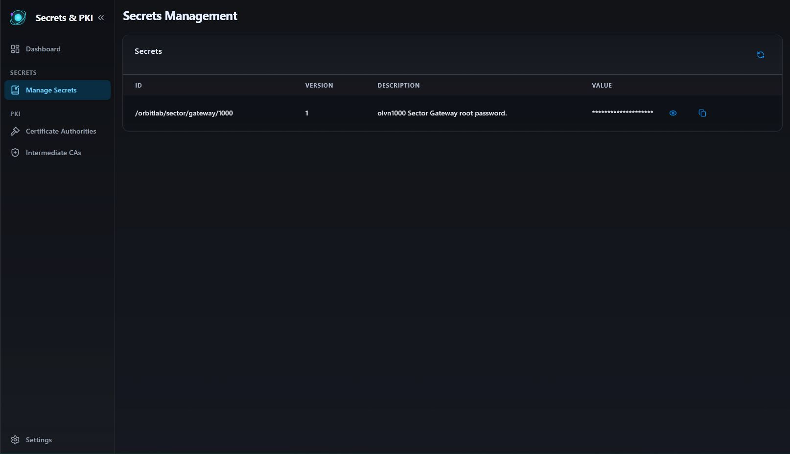

# OrbitLab Screenshots

This document provides an overview of the OrbitLab user interface through screenshots of key application screens.

## System Initialization

The initialization screen guides users through the initial setup process for OrbitLab, including cluster configuration, network settings, and service bootstrapping.

## Dashboard

***HEAVY WIP***
The main dashboard provides an overview of cluster health, resource utilization, and recent activity across the OrbitLab platform. Users can quickly assess the status of their infrastructure and navigate to specific management areas.

## Sectors

The sectors view shows the logical organization of infrastructure resources into manageable groups, providing multi-tenant isolation and resource allocation across different teams or projects.

## LXC Appliances

***HEAVY WIP***
The appliances management interface allows users to browse, deploy, and manage pre-configured application containers and service templates. This screen shows the available appliance catalog with deployment options.

## PKI Management

The Public Key Infrastructure (PKI) management interface provides certificate lifecycle management, including certificate authority operations, certificate issuance, and renewal workflows.

## Proxmox Integration

This screen demonstrates OrbitLab's integration with the underlying Proxmox Virtual Environment, showing how OrbitLab extends and enhances the native Proxmox capabilities.

## Secrets Management

The secrets management interface provides secure storage and access control for sensitive configuration data, API keys, passwords, and other credentials used across the infrastructure.
